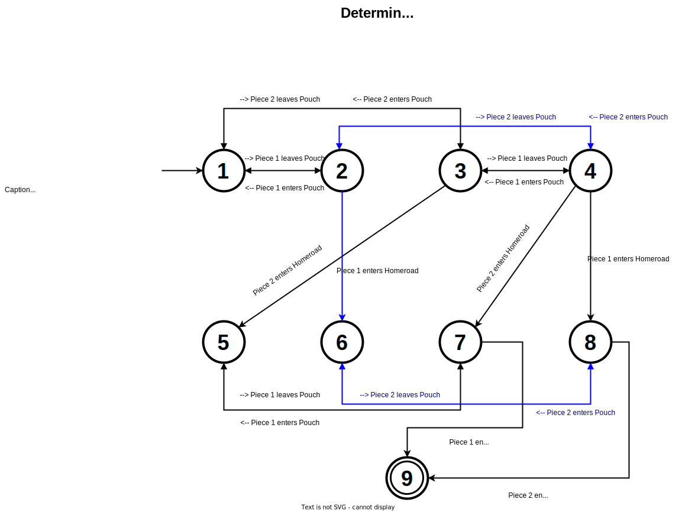

# ludo-game
Command-line based ludo-game in Java. I've applied a state-pattern in order to keep track of the current state of the pieces on the board, it makes handling the game-logic way easier,
especially if you'd like to expand the game-logic in the future. It's based on the following deterministic finite Automaton (DFA):

